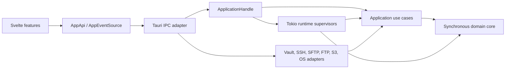
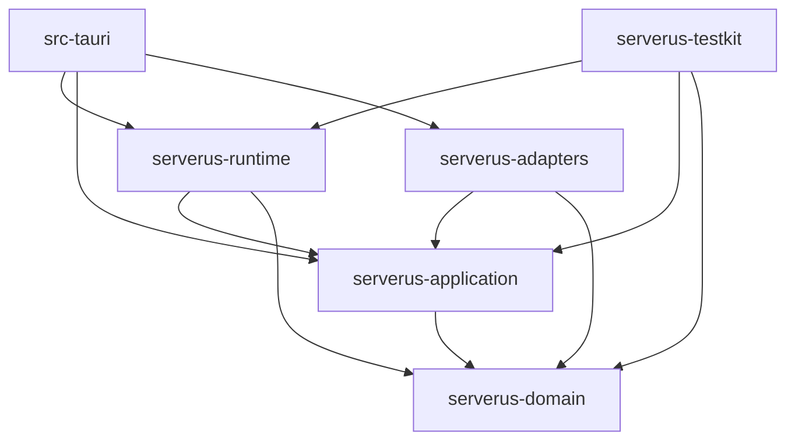

# Serverus Architecture

> **Status:** accepted target architecture; migration in progress.
>
> This document defines where Serverus is going and the gates for getting
> there. It does not claim that the current source tree already conforms. The
> behavior contract remains [README.md](README.md), [AGENTS.md](AGENTS.md), and
> the tests while the migration is underway.

Serverus is a modular desktop monolith: one Tauri application, one native
process, one Tokio runtime, and one Svelte WebView. Internally it combines a
synchronous functional core, Ports and Adapters, DDD-lite bounded contexts,
an actor-like runtime, capability-based remote endpoints, and a feature-based
frontend.

The goal is not to maximize the number of layers. The goal is to make domain
rules testable without Tauri, the WebView, real time, a filesystem, or a
network, and to make invalid dependency and lifecycle choices difficult to
express.

See also:

- [Context map and canonical language](CONTEXT-MAP.md)
- [ADR 0001: Target architecture](docs/adr/0001-target-architecture.md)
- [ADR 0002: Testing strategy](docs/adr/0002-testing-strategy.md)

## System shape

Serverus remains:

- one installable desktop application;
- one native process and one Rust async runtime;
- one Svelte WebView;
- usable without a separate backend service or daemon;
- a modular monolith, not a distributed system.

Serverus does not adopt microservices, event sourcing, a mandatory background
daemon, a trait for every type, or a repository abstraction for ordinary
in-memory state. These choices may be revisited only through a new ADR backed
by a concrete product need.



## Baseline at decision time

At the time of this decision, Serverus has useful seams but does not yet have
the target boundaries:

- `src-tauri` is one Cargo package; there is no root Cargo workspace.
- `AppState` exposes separate vault, session, transfer, edit, quick-unlock,
  and activity managers to every Tauri command.
- `commands.rs` maps IPC but also coordinates managers, filesystems,
  autostart tunnels, session teardown, transfer setup, and protocol-specific
  S3 behavior.
- `SessionManager` owns a global registry, imports vault and protocol types,
  emits Tauri events directly, and exposes shared network handles. The SSH
  handle is protected by an async mutex.
- Reconnect scheduling and host-key retry orchestration live in the frontend
  tabs store. The backend only detects a dropped SSH connection and emits an
  event.
- `RemoteFs` is a valuable existing port, but it combines common browsing,
  POSIX-like operations, resume, replacement, and stream access. S3-specific
  ACLs escape through concrete `S3Fs` access, while tar transfers carry a
  concrete `SshSession`.
- `TransferManager` combines queueing, state transitions, planning, traversal,
  retries, execution, progress, local filesystem access, and tar selection.
- Tauri event DTOs and transfer runtime types depend on each other.
- The frontend accesses generated commands and events through `$lib/api`, but
  there is no injectable application API boundary. Stores are module-level
  singletons, reconnect is presentation logic, and several components combine
  view rendering with application and filesystem workflows.
- `VaultPayload` currently acts as persistence model, mutable application
  model, and source for IPC DTOs. Secret updates already have implicit
  tri-state semantics, but `connection_secrets` reads existing plaintext
  credentials into the WebView.
- Runtime context IDs, generation checks, parent cancellation, internal typed
  application events, and complete snapshot queries do not exist yet.

The current code also contains strong assets that migration must preserve:

- atomic encrypted vault writes with backup and transactional mutation tests;
- the `RemoteFs`, `QuickUnlock`, and `ProgressSink` seams;
- pure tree operations and path-safety checks;
- real SSH/SFTP, FTP, and S3 integration fixtures;
- recursive FTP transfer coverage;
- S3 multipart abort behavior;
- remote-edit staging, promotion, rollback, cancellation, and cleanup tests;
- frontend stale-connect guards and generated Rust-to-TypeScript bindings.

The baseline has two explicit Stage 0 blockers. The SSH shell roundtrip test is
intermittent under the full suite, and binding export is a side-effecting unit
test without a CI dirty-tree check. Neither is masked with retries.

## Current migration status

The root Cargo workspace and all five target library crates now exist. The
Stage 0 SSH-shell and binding-generation blockers are resolved. The first
vertical slices are live: Transfers has a pure domain state machine and an
application command handler, runtime-context generations have explicit lock,
switch, cancellation, stale-lease, and per-unlock access-epoch semantics, and
the frontend Transfers model uses injected `AppApi` / `AppEventSource`
instances. Session connection planning now accepts only a lifecycle-authorized,
fully materialized plan; the former public connector that could read the vault
without an access lease was intentionally removed. Legacy managers and commands
remain behind transitional integration while the later bounded contexts are
extracted incrementally.

Known transitional lifecycle debt is tracked explicitly rather than hidden by
the new boundaries:

- tar pack/unpack still nests `spawn_blocking` work below an abortable transfer
  worker, so Stage 2 must give that blocking child explicit ownership and join
  semantics before claiming complete transfer quiescence;
- terminal/tunnel open paths still rely on late ownership validation and
  rollback instead of full `SessionOperationRegistry` admission (Stage 4);
- an in-progress remote-edit promotion preserves the original through
  backup/rollback, but its shutdown wait is not yet bounded (Stage 5).

## Non-negotiable invariants

Every migration stage preserves these rules:

1. Passwords, passphrases, private keys, DEKs, and equivalent secret material
   never enter logs, debug output, human-readable errors, or unrelated IPC.
2. The master password is never persisted. Secret buffers are zeroized when
   their authorized lifetime ends.
3. A vault payload is never written unencrypted. Vault replacement is atomic
   and retains the previous valid version as `.bak`.
4. A failed vault mutation does not change the in-memory committed model.
5. Recursive FTP directory upload and download continue to work.
6. Remote-edit upload never destroys the original on staging, finalize, or
   promotion failure, and temporary resources are cleaned up.
7. Transfer cancellation cannot escape an authorized local download root or
   leave an untracked multipart upload.
8. Unknown and changed SSH host keys require an explicit, current user
   decision; changed keys remain visually and semantically distinct.
9. OS-specific behavior stays behind platform ports or tightly scoped
   `cfg`-gated adapters.
10. Terminal views remain mounted while hidden, and fitting a hidden terminal
    remains safe.
11. Transfer queues and history are owned by a live session, not by a persisted
    connection definition or hostname.
12. Protocol selection does not leak above the adapter composition boundary;
    use cases select behavior from capabilities.

The current implementation does not fully prove invariant 2: parts of the
decrypted vault model and live FTP/S3 credential state use ordinary `String`
storage. Stage 0 must characterize their lifetime, and the relevant adapter
migrations must replace them with explicit zeroizing ownership. A vault lock
may preserve already-authenticated work, but it must not silently authorize
new secret consumption.

## Canonical language

The authoritative glossary is [CONTEXT-MAP.md](CONTEXT-MAP.md). In particular:

- **Vault**, not workspace, is the encrypted product document.
- **Connection** is persisted configuration; **session** is a live instance.
- **Runtime context** is the generation-scoped owner of live work for one
  selected vault.
- **Remote endpoint** is capability-bearing; it is not always a POSIX
  filesystem.
- **Vault lock** and **vault switch** are different lifecycle operations.

## Bounded contexts

Contexts are vertical ownership boundaries. They are not global `entities`,
`services`, or `repositories` folders.

### Vault and Connection Catalog

Owns:

- create, select, unlock, lock, and switch vault;
- connection definitions and validation;
- catalog folders and tree invariants;
- settings, import/export, known-host records, and tunnel definitions;
- secret update intent and authorized secret resolution;
- payload version migration at the application boundary.

It does not own AES-GCM, Argon2, atomic file replacement, Keychain, Windows
Hello, filesystem pickers, or IPC DTOs. Those are adapter concerns.

### Connectivity

Owns:

- connect and disconnect workflows;
- jump-chain validation and traversal;
- host-key challenges and decisions;
- authentication and reconnect policy;
- session lifecycle and capabilities;
- terminal channels and tunnels.

Connectivity exposes a live endpoint capability handle. It does not own file
transfer scheduling or remote browser presentation.

### Remote Resources

Owns:

- remote path and safe-name semantics;
- listing, stat, read, write, create, move, and removal operations;
- common browser entries at the application boundary;
- endpoint capabilities and their contracts.

It models object-store differences honestly. A bucket, prefix, and object do
not become POSIX directories or files merely to fit one large trait.

### Transfers

Owns:

- transfer requests and plans;
- recursive expansion;
- queueing, priority, and per-session concurrency;
- pause, resume, cancellation, conflicts, retry, and progress;
- metadata policy and executor strategy selection;
- plain stream, multipart, resumable, and tar strategies.

Transfers do not select a protocol or call a Tauri event emitter.

### Remote Edit

Owns:

- private cache allocation and cleanup;
- initial download and editor launch workflow;
- watcher debounce and save coalescing;
- remote staging, atomic promotion, rollback, and cancellation;
- edit lifecycle state and user-visible result events.

It consumes remote-resource, file-watcher, and editor-launcher ports. It does
not import `notify`, platform open commands, Tauri, or a protocol SDK.

### Desktop Platform

Provides adapters for:

- Touch ID, Windows Hello, and the Linux no-op fallback;
- sleep and user-activity signals;
- native filesystem access and permissions;
- file pickers, URL/editor opening, and native drag-and-drop;
- platform defaults such as terminal font selection.

This is a supporting boundary, not a catch-all for code without a clear owner.

## Target Rust workspace

The target physical layout is:

```text
Cargo.toml
crates/
  serverus-domain/
  serverus-application/
  serverus-runtime/
  serverus-adapters/
  serverus-testkit/
src-tauri/
src/
```

Initially, `serverus-adapters` remains one crate with substantial modules for
vault persistence/crypto, SSH/SFTP, FTP, S3, local filesystem, quick unlock,
watching, editor launch, and platform behavior. It is split further only when
dependency isolation or build time provides evidence for doing so.

Each context or crate gains a short README when it is created, covering:

- responsibility;
- public API;
- allowed dependencies;
- invariants;
- required tests.

### Dependency direction

An arrow means “depends on”:



Rules:

- `serverus-domain` is synchronous and effect-free. It has no Tauri, Tokio,
  protocol SDK, filesystem, Specta, IPC, persistence record, mutex, channel,
  spawn, sleep, or wall-clock access.
- `serverus-application` owns use cases and inward-facing effect ports. Async
  is allowed, but Tokio runtime APIs, real clocks/sleeps, filesystems, protocol
  SDKs, Tauri, and task spawning are not.
- `serverus-runtime` owns Tokio supervisors, tasks, channels, timers,
  cancellation, registries, and progress aggregation. It imports no Tauri or
  protocol SDK.
- `serverus-adapters` implements application ports. It may use protocol,
  crypto, filesystem, and OS libraries, but never becomes a dependency of an
  inner crate.
- `serverus-testkit` supplies fake ports, deterministic builders, fixtures,
  and contract suites. Production crates do not depend on it.
- `src-tauri` is the composition root and desktop adapter. Tauri, Specta, IPC
  DTOs, API error mapping, event mapping, binding export, and window lifecycle
  stay here.

Domain types do not derive a persistence or IPC schema merely for convenience.
Small format-neutral dependencies are acceptable only when they do not create
an effect, serialization, or outer-layer contract.

## Application boundary

Tauri manages one `ApplicationHandle`, not a public service locator. A command
performs exactly four operations:

1. parse and validate its IPC DTO shape;
2. map it to an application command or query;
3. invoke `ApplicationHandle`;
4. map the result or typed error back to an IPC DTO.

A Tauri command does not traverse directories, choose a protocol, access vault
payloads, hold a mutex, schedule retry, spawn workers, coordinate teardown, or
emit an internal event.

Application ports are introduced only at real effect boundaries. The initial
set is expected to include:

- `VaultRepository` and `SecretResolver`;
- `SessionConnector` and `RemoteEndpointFactory`;
- `QuickUnlock`;
- `LocalFileSystem`, `EditorLauncher`, and `FileWatcher`;
- `Clock`, `Sleeper`, `IdGenerator`, and `RandomSource`;
- `AppEventSink`.

Names may sharpen during extraction, but a port must represent a coherent
external capability, not mirror every concrete method or type.

## Runtime ownership and lifecycle

Mutable runtime state has one owner. Sharing an `Arc<Mutex<NetworkHandle>>`
across unrelated subsystems is not ownership.

```text
AppCoordinator
└── RuntimeContext
    ├── SessionSupervisor
    │   └── SessionActor
    │       ├── terminal tasks
    │       ├── tunnel tasks
    │       └── protocol endpoint handle
    ├── TransferSupervisor
    │   └── transfer workers
    └── RemoteEditSupervisor
        └── watcher/upload tasks
```

Actors use Tokio `mpsc`, `watch`, and `oneshot` channels plus cancellation
tokens; no actor framework is required. A session actor owns its network
handle and accepts commands such as open endpoint, open terminal, resize,
write, open tunnel, and close. No caller holds a network-handle mutex across an
await.

Every child task has an explicit parent. Closing a parent cancels and awaits
its children within a bounded shutdown policy. Detached tasks are allowed only
for process-terminal cleanup that cannot affect application state, and require
an explanatory comment.

### Runtime context generations

`RuntimeContextId` is a non-reusable generation identifier, distinct from a
vault path, connection ID, and session ID.

- On first successful create/unlock, the coordinator creates a runtime context
  for the selected vault.
- Locking that same vault changes secret access to `Locked` but does not cancel
  the context. Already-authenticated operations may continue only while they
  do not resolve or retain unauthorized secret material.
- Every successful unlock creates a new `VaultAccessEpoch` inside the same live
  context. Secret-consuming commands carry that epoch; lock revokes it, and a
  later unlock never re-authorizes a queued command or decision from an older
  epoch. Active-only leases intentionally omit the epoch so established
  sessions and transfers keep their documented lock semantics.
- Switching vault retires the old context, cancels and awaits all owned work,
  invalidates pending challenges, and prevents new registration from late
  results. A new context is created only after the newly selected vault is
  successfully created or unlocked.
- Application exit retires the active context before adapter cleanup.

SSH terminals and tunnels may continue while the vault is locked because the
transport is already authenticated. An adapter that needs credentials for a
new physical connection or for each request, such as FTP pool expansion or S3
request signing, may not keep using vault secrets after lock. It must use an
explicitly authorized session-owned secret lifetime, suspend the operation, or
request unlock according to the eventual context policy. This policy must be
covered per adapter; “live session” is not blanket permission to retain a
password indefinitely.

Every command, challenge, event, delayed reconnect, and task registration
carries its context ID. A late result from a retired context may clean up its
own resources but cannot mutate current state or emit a current event.

## Remote endpoint capabilities

The current `RemoteFs` is migrated into a small common browsing/streaming core
plus opt-in capabilities. The exact Rust shape may use subtraits, typed handles,
or capability objects, but it must make unsupported behavior explicit before
execution.

Common operations cover listing, stat, directory-like creation, removal,
move/rename where available, and opening read/write streams. Optional
capabilities include:

- resumable read and resumable write;
- permissions and modification time;
- atomic replace;
- server-side copy;
- object ACL;
- bucket management;
- multipart upload;
- tar transport.

The transfer planner asks whether a capability exists. It does not branch on
`Protocol::Ssh`, `Protocol::Ftp`, or `Protocol::S3`. Protocol switches live in
adapter construction only.

`RemotePath`, `LocalPath`, persistence records, runtime handles, and IPC
`BrowserEntryDto` remain distinct types. The local filesystem adapter does not
reuse a DTO physically owned by a remote protocol module.

## Transfer architecture

Transfers are the first pilot extraction because they contain substantial pure
logic and already depend on a remote-operation seam.

- `TransferPlanner` converts a request, endpoint capabilities, metadata policy,
  conflict policy, and retry policy into a plan.
- `DirectoryExpander` turns a directory request into bounded transfer actions
  without recursive stack growth.
- `TransferScheduler` owns queues, priorities, pause state, permits, and
  per-session concurrency.
- `TransferExecutor` copies one byte stream and reports effect outcomes.
- `TransferStateMachine` validates transitions and decides conflict/retry/
  cancellation effects.
- `ProgressTracker` produces throttled snapshots, speed, and ETA.

Tar acceleration, multipart upload, and plain streaming are executor
strategies selected from capabilities. User prompts are state-machine effects,
not waits hidden inside a byte copier.

A state-machine transition consumes a semantic event and returns a new state
plus zero or more effects. Example events include worker started, conflict
found, conflict resolved, recoverable failure, retry budget exhausted, and
cancel requested. Effects include start action, request decision, schedule
retry, clean partial data, and publish completion.

## Connectivity workflows

### Host-key decisions

An unknown or changed host key produces `NeedsHostKeyDecision`, not a special
API error. The backend stores a challenge containing the context, connection,
hop, fingerprint, key material, and expiry, then sends only the display data
and opaque challenge ID to the frontend.

`AcceptHostKey(challenge_id)` or `RejectHostKey(challenge_id)` resumes or ends
the same backend workflow. A response for a retired context, expired challenge,
different connection, or already-decided challenge is rejected. The frontend
does not resend trusted key material and does not manually reconstruct the
connect operation.

During the incremental migration, the current prompt DTO carries the exact
`(RuntimeContextId, VaultAccessEpoch)` pair that issued it. Acceptance must
return both values, so even a lock followed by an unlock of the same vault
invalidates the old decision. The opaque backend challenge registry remains the
target replacement for the legacy retry-based prompt flow.

### Reconnect

Reconnect policy belongs to `SessionSupervisor`. The backend owns attempt
limits, backoff, retryability, cancellation, and restoration of session-owned
state. The frontend only renders states such as `Connected`, `Reconnecting`,
`WaitingForDecision`, `Disconnected`, and `Failed`.

Runtime tests use paused/deterministic time to cover close-during-backoff,
vault switch, success, exhausted budget, non-retryable authentication errors,
and late-result races. No reconnect test waits real seconds.

## Vault persistence and secret boundary

Three models remain physically separate:

1. crypto container records such as `CryptoHeaderV1`;
2. versioned persistence records such as `VaultDocumentV1` and
   `PersistedConnectionV1`;
3. current domain models and invariants.

The vault adapter authenticates and decrypts the container, deserializes the
declared payload version, migrates records, and maps them into the domain. Save
performs the reverse mapping. Historical versions have golden fixtures.
Changing a domain type never silently changes the on-disk format.

Connection editing does not read existing secrets into the frontend. Public
connection DTOs retain presence flags. Each secret field is updated with an
explicit intent:

```text
KeepExisting | Replace(secret) | Remove
```

The current backend's `None` / empty / value convention already approximates
these semantics. Migration makes the intent type-safe and removes the
`connection_secrets` IPC command.

Secrets use explicit redacted `Debug` behavior and zeroizing storage where a
plaintext lifetime is unavoidable. Adapter errors retain technical source
chains but never format credentials, keys, decrypted payloads, or DEKs.

## Types, errors, events, and snapshots

Types are placed by purpose:

- domain value objects and state live with their bounded context;
- persistence records live in the vault adapter;
- runtime actor states and handles live in `serverus-runtime`;
- protocol configuration and SDK records live in their adapter;
- Specta-derived IPC DTOs live in `src-tauri`.

Errors have four layers:

- domain errors express invalid input, invariant, or transition;
- application errors express authorization, missing runtime entities,
  retired context, cancellation, and expired decisions;
- adapter errors retain technology-specific diagnostics and source chains;
- API error DTOs expose a stable code, safe message, and optional structured
  details.

Tauri events are not the internal event bus. Inner layers publish typed
`AppEvent` values. The desktop adapter maps them to IPC events.

Every runtime event envelope carries at least context ID, entity ID, sequence
number, timestamp from the injected clock, and command correlation ID.
Events are not the source of truth: sessions, transfers, and remote edits each
provide a snapshot query so the frontend can recover after sleep, reload, or a
missed event. This is not event sourcing.

## Frontend architecture

The target feature layout is:

```text
src/
  app/
  features/
    vault/
    connections/
    sessions/
    file-browser/
    terminal/
    tunnels/
    transfers/
    remote-edit/
    settings/
  shared/
    api/
    platform/
    ui/
```

Each substantial feature may contain `model`, `api`, `ui`, and `tests` as
needed. Empty ceremonial folders are not created.

`AppApi` is the frontend application interface. `TauriAppApi` is its production
implementation and the only module allowed to import generated command
bindings. `AppEventSource` similarly hides generated event bindings. Platform
APIs for dialogs, WebView drag/drop, version lookup, and native dragging stay
behind focused frontend platform adapters.

An app model is created at startup with an API and event source, then supplied
through Svelte context. Tests create independent app instances with
`FakeAppApi` and `FakeEventSource`; they do not reset module singletons or mock
the generated module graph.

Components render view models and send user intents. Selection, range
selection, keyboard navigation, virtual-window calculation, drag decisions,
recursive operation planning, and ACL loading belong in testable controllers,
not in one presentation component.

Migration is feature by feature. The existing `$lib/api` barrel is a useful
single import seam, but it is not yet dependency injection and must not be
mistaken for the target boundary.

## Testing strategy

[ADR 0002](docs/adr/0002-testing-strategy.md) defines the decision. The layers
are:

| Layer | Proves | Excludes by default |
|---|---|---|
| Domain | Invariants, state transitions, policies, path/name rules | Async, mocks, network, filesystem |
| Application | Use-case outcomes and effect requests | Tauri, real adapters, wall-clock time |
| Runtime | Ownership, ordering, cancellation, races, retry, snapshots | Real network and real sleeps |
| Capability contracts | Consistent applicable endpoint semantics | UI and unrelated workflows |
| Infrastructure integration | Real SSH/SFTP, FTP, S3, vault, filesystem, tar, tunnel, watcher behavior | Re-testing all domain policy branches |
| Frontend model/component | Intents, event handling, stale generations, interactions | Real Tauri runtime where avoidable |
| Desktop E2E | A small set of critical wired user journeys | Exhaustive edge-case coverage |

As ports are extracted, `serverus-testkit` will supply:

- `InMemoryVaultRepository` and `InMemoryRemoteEndpoint`;
- fake session connector, clock, sleeper, ID generator, random source, editor,
  watcher, and event sink;
- `TestApplicationBuilder` with safe defaults;
- fixture builders and reusable capability contract suites.

The current testkit slice provides deterministic runtime-context IDs, recorded
context events, and injectable cleanup outcomes. In-memory vault/endpoint
implementations, clocks, sleepers, and application builders are added with the
bounded context that defines their contracts; empty speculative fakes are not
created ahead of those ports. Once introduced, an in-memory endpoint must pass
every common contract expected of real applicable adapters. A fake that behaves
more conveniently than production is a defect.

Regression tests are added at the lowest layer that can reproduce a bug. Real
integration coverage is retained for recursive FTP, resume, tar fallback,
multipart abort, vault recovery, remote-edit rollback, changed host key, tunnel
roundtrip, lock semantics, and vault switching.

Property tests are favored for paths, name generation, tree mutations, state
transitions, jump chains, imports, and migrations. Mutation testing and fuzzing
are scheduled selectively after the pure surfaces exist; they are not gates
for the initial workspace extraction.

## Verification and architecture enforcement

The canonical local gate is:

```bash
npm run verify
```

Integration tests that spawn `sshd` require the macOS sandbox to be disabled,
as documented in `AGENTS.md`.

`npm run verify` runs formatting, Clippy, workspace Rust tests, frontend
checks/tests, a frontend production build, deterministic binding verification,
and architecture checks. CI additionally runs
`npm run tauri build -- --no-bundle` on every supported build runner.

The current `architecture:check` gate verifies workspace membership, inward
dependencies of the domain/application/runtime crates, ignored Rust tests, and
the single-handle Tauri state shape and migrated Transfers frontend boundary.
Binding freshness is a separate CI gate. As extraction advances, target
architecture checks will also reject:

- Tauri, Tokio, Specta, filesystem, or protocol dependencies in the domain;
- Tauri, protocol SDKs, real time/sleep, task spawning, or adapters in the
  application crate;
- Tauri or protocol SDKs in the runtime crate;
- protocol SDK use outside adapters;
- generated command/event imports outside `TauriAppApi` and
  `TauriAppEventSource`;
- stale generated bindings or any generation-created working-tree diff;
- retried or quarantined flaky tests without an accepted ADR and an expiry
  owner.

Architecture checks use Cargo metadata and narrow source rules. They do not
attempt to implement a second Rust or TypeScript compiler with regexes.

## Migration plan

Migration is vertical and behavior-preserving. Each stage leaves a runnable
application and passes the full gate before the next begins.

### Stage 0: Freeze behavior and make verification trustworthy

- Land this architecture, context map, and ADRs.
- Remove the intermittent SSH integration-test failure at its cause.
- Replace side-effecting binding export through a normal unit-test run with a
  deterministic generation/verification command and a clean-tree CI check.
- Record characterization tests for lifecycle and security rules not already
  covered, especially lock, vault switch, stale operations, and secret lifetime.
- Inventory current tasks, handles, and shutdown paths.

Exit: the current application has one reliable full gate, no known flaky
tests, no binding drift, and executable coverage for critical behavior.

### Stage 1: Create the workspace and application boundary

- Add domain, application, runtime, adapters, and testkit crates.
- Introduce `ApplicationHandle`, `RuntimeContextId`, and typed application
  events without changing user behavior.
- Wrap old managers behind transitional adapters.
- Move IPC DTOs and mappings to `src-tauri`; route commands through the handle.
- Add dependency-graph checks.

Exit: new code can enter only through the target dependency direction, even
while legacy implementations remain wrapped.

### Stage 2: Extract Transfers

- Extract state machine, policies, planner, expander, scheduler, executor, and
  progress tracker in that order.
- Build testkit endpoint fakes and applicable contract suites.
- Wrap the existing SFTP/FTP/S3 implementations while preserving all real
  integration tests.

Exit: transfer policy and lifecycle tests run without Tauri, network, or a real
filesystem; adapters still prove recursive FTP, resume, tar, and multipart.

### Stage 3: Extract Vault and Connection Catalog

- Separate domain models, persistence records, crypto container, migrations,
  quick-unlock adapters, and application use cases.
- Add historical golden fixtures.
- Replace secret read-back with explicit patch intents and zeroizing ownership.

Exit: vault application tests prove transactional behavior, lock authorization,
migration, and switch preparation independently of Tauri.

### Stage 4: Extract Connectivity and runtime ownership

- Introduce session actors and `SessionSupervisor`.
- Move reconnect, host-key challenge continuation, terminal/tunnel ownership,
  and structured cancellation into the backend runtime.
- Enforce stale-context rejection and adapter-specific locked-secret policy.

Exit: session lifecycle and races are deterministic runtime/application tests;
the frontend contains no reconnect scheduler.

### Stage 5: Extract Remote Resources and Remote Edit

- Replace the wide remote trait with capability contracts.
- Make remote edit an explicit state machine using watcher, editor, and
  endpoint ports.
- Preserve staging/promotion/rollback behavior and integration coverage.

Exit: S3-specific features no longer require concrete downcasts or branches in
commands/use cases, and remote-edit lifecycle is testable with fakes.

### Stage 6: Migrate the frontend by feature

- Introduce `AppApi`, `AppEventSource`, platform adapters, and app-scoped
  models through Svelte context.
- Move one feature at a time and split controller logic from presentation.
- Delete direct generated command/event access and module-level store state.

Exit: every feature test can create an independent app model, and architecture
checks prove generated bindings are isolated.

### Stage 7: Desktop E2E and hardening

- Add a small cross-platform-compatible E2E suite after verifying the chosen
  harness against the project's pinned Tauri versions and target OS support.
- Add selected property, mutation, and fuzz jobs.
- Remove transitional manager adapters and obsolete compatibility seams.

Exit: all criteria below are met without hidden legacy bypasses.

## Where a change belongs

| Change | Primary location | Required proof |
|---|---|---|
| Pure validation, invariant, policy, or state transition | Context module in `serverus-domain` | Domain tests |
| User-visible use case or effect coordination | Context module in `serverus-application` | Application tests with testkit |
| Task ownership, queue, timer, cancellation, or actor command | `serverus-runtime` | Deterministic runtime tests |
| SSH/SFTP/FTP/S3/crypto/filesystem/OS implementation | `serverus-adapters` | Applicable contracts and integration tests |
| Tauri command, IPC DTO, event mapping, composition | `src-tauri` | Thin mapping test and binding verification |
| Feature behavior/controller | `src/features/<feature>/model` | Frontend model tests |
| Svelte rendering and interaction | `src/features/<feature>/ui` | Component tests |
| Shared fake, fixture, or adapter contract | `serverus-testkit` | Testkit self-tests/contracts |

A bug fix first identifies the lowest row that can reproduce the defect. A new
port requires a real external effect boundary. A new crate requires evidence
that a module boundary is insufficient.

## Completion criteria

The migration is complete when:

1. Domain and most application tests run without Tauri, network, filesystem,
   WebView, or wall-clock sleeps.
2. Cargo and CI prove the dependency rules above.
3. Every Tauri command only maps DTOs and invokes an application command/query.
4. No frontend feature imports generated bindings or Tauri IPC directly.
5. Every long-lived operation belongs to a runtime context and has explicit
   cancellation and shutdown semantics.
6. Transfer, session, and remote-edit lifecycles are explicit state machines.
7. Every protocol adapter passes its applicable capability contracts.
8. Object-store behavior does not leak through accidental filesystem methods
   or protocol branches in use cases.
9. Persistence records, domain models, runtime types, protocol types, and IPC
   DTOs are physically distinct.
10. There are no known flaky tests or CI retries hiding instability.
11. Binding generation is deterministic and leaves no diff.
12. A contributor can use this document to place a new use case, adapter, or
    UI feature without reading the whole repository.
