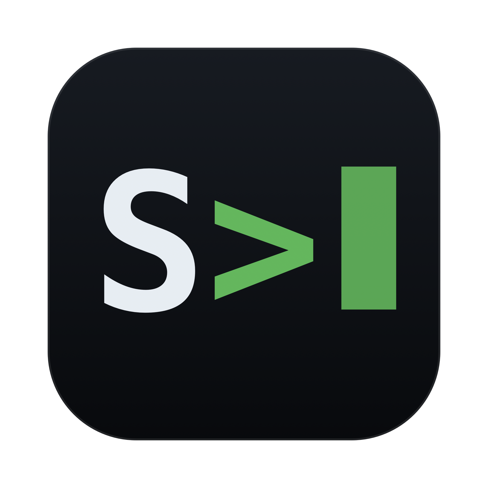

<div align="center">



# Serverus `S>`

**One window for SSH, SFTP, FTP/FTPS and S3 — terminal, dual‑pane file
manager and tunnels, behind a single encrypted vault unlocked with Touch ID.**

A native macOS connection manager. Built with Tauri 2, a Rust backend and a Svelte 5 front end.

[](#written-entirely-by-ai)
-black)


[](LICENSE)

</div>

---

## Why

For years on Windows I lived in **WinSCP**, and I loved one thing about it
above everything else: the **terminal and SFTP were in the same place**, tied
together by the same connection. You open a server once and you get both — a
shell *and* a file browser — sharing one login and one mental model, because
of course they should; it's the same server. WinSCP looks like a postcard from
2002, but it *works*, and it works **flawlessly**.

Then I moved to the Mac and couldn't find anything even close. Every app did
only half the job, or cost real money, and none of them were as simple,
minimal and genuinely pleasant as WinSCP.

The one halfway‑adequate thing I found was **electerm** — and it drove me up
the wall. On my MacBook Pro (M5) it pinned the **GPU at 40%** and chewed
through **more than a gigabyte of RAM**… to draw just one terminal window. It's absurd. And the worst part: for all that weight it's ugly, clunky,
heavy — *and it doesn't even work.* It flatly **refused to copy folders over
SFTP/FTP.** What is this nonsense? Why won't the one basic thing I need
actually happen?

I was tired of juggling one app for the terminal and another for file
transfer, plus a scratchpad of tunnel commands on the side. Two apps meant two
places to store credentials, two UIs, two mental models — for what is
fundamentally one connection to one server.

So I did the obvious 2026 thing: I had an AI build the app I actually wanted —
a **proper, minimal, convenient, free and open‑source** connection manager —
so that nobody else has to suffer the way I did.

And then I thought: the whole thing is already written on a cross‑platform
stack, so why *not* make Linux and Windows versions too? Maybe I'll need them
one day, maybe you will — and either way, why not? So I asked the AI to add
support for every operating system, and that's how this turned into a full
multi‑platform app. Because — well, why not?

Serverus folds all of it into one window:

- a **terminal**, a **dual‑pane file manager** and **SSH tunnels** share the
  same connection;
- every server, secret and setting lives in **one encrypted file** you can
  back up or sync by copying it;
- unlock is **Touch ID** (with a master‑password fallback that is never
  stored anywhere);
- and **recursive transfers actually work** — that's the project's very first
  integration test.

It is a personal tool built to open‑source quality (MIT, CI, tests against
real servers).

## Written entirely by AI

Full disclosure, and honestly part of the point: **every line of Serverus was
written by [Claude Fable 5](https://claude.com/claude-code).** I have never
written a single line of **Rust, Tauri or Svelte** in my life — I don't know
these stacks. I brought the itch and the taste: I described what I wanted, made
the product decisions, used the app, and reported the bugs; the AI did all the
actual engineering.

This project is partly a real tool I use every day and partly a demonstration
of how far that workflow goes. If it changes how much you want to trust the
code, that's completely fair — so read it. It's MIT, it's small, and the test
suite runs against **real** SSH/FTP/S3 servers, not mocks.

---

## Features

### 🔐 One encrypted vault
- A single portable file (`*.serverus`) holds the whole app state: folder
  tree, connections, secrets, known host keys and settings. Back up or sync
  everything by copying one file.
- **Envelope encryption** with audited crates only — never hand‑rolled crypto:
  ```
  master password ──Argon2id(m=64MiB, t=3, p=4)──▶ KEK
  KEK ──AES‑256‑GCM──▶ decrypts DEK (random 256‑bit data key)
  DEK ──AES‑256‑GCM──▶ decrypts the payload (the whole vault)
  ```
- Changing the master password re‑encrypts only the DEK — your data is never
  touched.
- **Atomic, crash‑safe writes**: temp file → `rename`, with a `.bak` copy of
  the previous version kept alongside. The payload is never written to disk
  unencrypted.
- **Config export & import** — a plain‑JSON, secret‑free export of everything,
  and an import that merges a Serverus export *or a hand‑written file* back in
  (handy for migrating from another app). The format is documented in
  [docs/CONFIG_FORMAT.md](docs/CONFIG_FORMAT.md).
- SSH keys can live **as text inside the vault** — one click imports a key
  file and converts it, so backups and machine moves carry your keys too.
- The vault file location is picked **visually** (native save panel) or typed
  as a path.

### 👆 Touch ID / Windows Hello unlock
- After the first master‑password unlock, the data key is stored behind
  device biometrics: on macOS in the Keychain (`WhenUnlockedThisDeviceOnly` +
  `biometryCurrentSet`), on Windows wrapped by a **Windows Hello**‑protected
  signing key (`KeyCredentialManager`; the KeePassXC scheme — a stored
  challenge is signed on unlock, the deterministic signature is HKDF'd into
  the wrapping key).
- Everyday launch: Touch ID / Hello → vault open. The master password is
  always a working fallback and is **never persisted** — not in the Keychain,
  not on disk, not in memory longer than needed to derive the key.
- Changing the enrolled fingerprint set (macOS) or resetting Windows Hello
  invalidates the entry — Serverus just asks for the master password again.
- Linux: master password only for now (a Secret Service backend is on the
  roadmap).

### 🖥️ SSH sessions do triple duty
One SSH connection is multiplexed into three roles over a single TCP session:
- **Terminal** — xterm.js with 256‑color + truecolor, 10 000‑line scrollback,
  search (`⌘F`), copy‑on‑select, multiline‑paste confirmation, configurable
  font. Multiple terminals per tab as internal channels.
- **Files** — SFTP file panel over the same session — no second login.
- **Tunnels** — local port forwarding (`direct‑tcpip`).

Plus:
- **Auth**: password, key (ed25519 / ECDSA / RSA, with or without passphrase),
  or `ssh-agent`. Attempt order: agent → key → password.
- **Jump hosts**: chain bastions of any length; each hop just references
  another saved connection, so bastion config is never duplicated.
- **Host‑key verification**: SHA‑256 fingerprint dialog on first connect
  (accept & save / reject); a hard red warning on key change — never a
  default "OK".
- **Keep‑alive & auto‑reconnect** with remote‑directory restoration.

### 🗂️ Dual‑pane file manager
- Local files on the left, remote on the right. Each pane: editable path bar,
  column sort, hidden‑file toggle, live substring filter, and **virtual
  scrolling** for 10k+ entry listings without lag.
- Selection like a native file manager: click, `⌘`‑click to toggle,
  `Shift`‑click for a range, `⌘A` for all, and marquee (rubber‑band) select.
- **Drag & drop everywhere** — between panes, and **in and out of Finder**.
  Copy by default, move with `Alt`. (See the note on Tauri drag‑and‑drop
  below.)
- Operations: new folder / new file, rename (`F2`/`Enter`), recursive delete
  with confirmation, refresh, copy path, and chmod.
- **chmod dialog**: rwx × owner/group/others checkboxes synced with an octal
  field, plus recursive apply (files / dirs / both). Works over SFTP and FTP
  (`SITE CHMOD`).
- Symlinks are shown with an arrow and followed to their target.

### 📦 Transfer queue & acceleration
- A single per‑connection queue: file/folder, progress, speed, ETA, and
  pause / resume / cancel per item and globally.
- Up to **N concurrent files per server** (default 5); each server's queue is
  independent.
- Conflict handling: Overwrite / Skip / Rename with "apply to all", plus a
  default policy setting.
- **Resume of interrupted transfers** — SFTP by offset, FTP via `REST`.
- **mtime preservation** on copy (on by default).
- **tar‑stream acceleration** (the key speed feature): moving a folder of
  thousands of small files over SFTP/FTP is slow because of per‑file
  round‑trips. When the remote host has `tar`, Serverus streams the whole
  folder as a **single tar stream over the SSH channel** instead — download
  (`tar -cf -` → unpack locally) and upload (pack locally → `tar -xf -`). The
  UI shows the applied mode ("via tar stream") and offers a "force plain
  transfer" escape hatch.

### 🪣 S3‑compatible storage
Works with any S3‑compatible provider through a custom endpoint — AWS S3,
DigitalOcean Spaces, Cloudflare R2, Backblaze B2, Wasabi, MinIO, and more.
- **Buckets as folders**: leave the bucket blank and the panel root lists all
  buckets (mkdir/rmdir there = create/delete bucket); set a bucket and the
  panel opens inside it.
- **Prefixes as folders**: the flat key space is browsed with `/`‑delimited
  prefixes. It all flows through the same `RemoteFs` trait — the UI and
  transfer queue don't know it's S3.
- **Multipart uploads** (8 MiB parts), with unfinished multiparts aborted on
  cancel/error.
- **ACLs instead of chmod**: a public/private Mode column, loaded **in the
  background** after listing and cached; bulk **Make public / Make private**
  (recursive over a prefix for folders); an **upload‑ACL mode switch**
  (private / public / ask) right in the panel header; and **Copy public URL**
  with CDN / custom‑domain support. Providers without per‑object ACLs (R2,
  buckets with enforced Object Ownership) get a clear error instead of a
  hidden UI.

### ✏️ Remote edit
Double‑click a remote file → it downloads to an isolated temp folder and opens
in your editor (system default or a specific app like VS Code). An FSEvents
watcher auto‑uploads on every save with an unobtrusive "Uploaded ✓". Temp
copies are cleaned up on tab/app close.

### 🔒 Auto‑lock
Locks on an inactivity timeout (default 15 min; 0 = never) and when the Mac
sleeps. Locking zeroizes the DEK and all decrypted secrets from memory — but
**live sessions keep running** (the password was already handed to the
server); you just can't pull new secrets from the vault until you unlock.

---

## Screenshots

<!-- Drop images into docs/screenshots/ and reference them here, e.g.:


-->

_Coming soon._

---

## Install

The primary platform is **macOS 12+ on Apple Silicon**. **Windows 10+ and
Linux builds are experimental** — the code is cross‑platform and CI builds
all three, but only macOS gets day‑to‑day use.

### Download
Releases are built by GitHub Actions for every `v*` tag — nothing is compiled
on a developer machine. Grab the artifact for your OS from the releases page:

| OS | Artifact |
|---|---|
| macOS (Apple Silicon) | `Serverus_x.y.z_aarch64.dmg` |
| Windows x64 | `.msi` or NSIS `-setup.exe` |
| Linux x64 | `.AppImage`, `.deb` or `.rpm` |

> The binaries are **not code‑signed or notarized**. On first launch macOS
> Gatekeeper may complain — right‑click the app → **Open**, or run
> `xattr -dr com.apple.quarantine /Applications/Serverus.app`. Windows
> SmartScreen will show "unrecognized app" — **More info → Run anyway**.

### Build from source
Requirements: a recent **Rust** (stable) toolchain, **Node.js 22+**, and Xcode
command‑line tools.

```bash
git clone https://github.com/fedorananin/serverus.git && cd serverus
npm install
npm run tauri build     # release .app + .dmg → ~/.cache/serverus-target/release/bundle/
```

For day‑to‑day development:

```bash
npm run tauri dev       # hot‑reloading dev build
```

> **Note on the build cache.** This repo can live in a cloud‑synced folder, so
> the Cargo build cache is redirected out of the project tree to
> `~/.cache/serverus-target` via a machine‑local `.cargo/config.toml`. Don't
> put `target/` inside the project.

### Local code signing (optional)

Builds are **unsigned by default** — nothing to configure, and CI/contributors
get a working ad‑hoc build. If you want your local builds signed with your own
certificate (handy on macOS so the Keychain / Touch ID entry stays bound to a
stable signature across rebuilds), create a self‑signed **Code Signing**
certificate in *Keychain Access → Certificate Assistant → Create a Certificate*
and point Serverus at it via a git‑ignored `.env.local`:

```bash
# .env.local  (git-ignored, never committed)
APPLE_SIGNING_IDENTITY="Local Dev"
```

`npm run tauri build` picks it up automatically (a tiny wrapper,
[`scripts/with-signing-env.mjs`](scripts/with-signing-env.mjs), loads
`.env.local` before invoking the Tauri CLI). This is **local‑only** signing —
distributing to other Macs without the Gatekeeper prompt still needs a paid
Apple Developer ID and notarization.

---

## First run

1. **Create a vault** and choose a master password. There is **no recovery** —
   this is by design; you're warned at creation.
2. Optionally enable **Touch ID** when prompted.
3. **Add a connection** (SSH / FTP / S3) from the sidebar, give it a name and
   an emoji or color badge, and drop it into a folder.
4. **Double‑click** the connection to open it in a new tab, then switch between
   **Files / Terminal / Tunnels** inside the tab.

Handy shortcuts: `⌘T` new tab · `⌘W` close tab · `⌘1..9` switch tabs ·
`⌘F` search terminal · `F2` rename · `⌘A` select all.

---

## Architecture

| Layer | Tech |
|---|---|
| Shell | Tauri 2 |
| Backend | Rust (stable, async / Tokio) |
| Frontend | Svelte 5 (runes) + TypeScript + Vite |
| Terminal | xterm.js |
| SSH / SFTP | `russh` + `russh-sftp` (pure Rust) |
| FTP / FTPS | `suppaftp` (+ `rustls`) |
| S3 | `aws-sdk-s3` (custom endpoints) |
| Crypto | `argon2`, `aes-gcm`, `rand`, `zeroize` |
| Keychain / Touch ID | `security-framework` + `objc2-local-authentication` |
| Finder drag‑out | `tauri-plugin-drag` |

The Rust backend keeps every connection and transfer off the UI thread; the
binary is ~18 MB.

```
src-tauri/src/
├── vault/       # file format, Argon2id/AES‑GCM crypto, atomic writes, Keychain/Touch ID
├── session/     # session registry, reconnect, keep‑alive
│   ├── ssh.rs   #   russh: auth, jump chains, PTY, channels
│   ├── sftp.rs  #   file ops over SSH
│   ├── ftp.rs   #   suppaftp: connection pool, recursive ops
│   ├── s3.rs    #   aws-sdk-s3: prefixes‑as‑folders, multipart, ACLs
│   └── tunnel.rs#   local port forwarding
├── transfer/    # queue, concurrency, tar acceleration, resume, progress events
├── watcher/     # remote edit: temp files + FSEvents + auto‑upload
├── autolock.rs  # inactivity / sleep locking
├── local_fs.rs  # the local pane
└── commands.rs  # thin Tauri command layer: parse → call module → return

src/  (frontend)
├── lib/api/         # generated, type‑safe wrappers over invoke() + events
├── lib/stores/      # Svelte 5 runes: vault, tabs, transfers, dnd, pane, hostkey
├── lib/components/  # Sidebar, FilePane, TransferQueue, TerminalView, dialogs…
└── routes/          # Unlock screen → Main screen
```

**Design principles**

- **Protocol abstraction.** SFTP, FTP and S3 all implement one `RemoteFs`
  trait (`list/get/put/mkdir/rename/delete/chmod/…`); the UI and transfer
  queue never know which protocol a session uses.
- **Secrets stay in the backend.** The frontend gets a redacted `PublicVault`;
  real secrets are fetched on demand only when the edit form needs them.
  Secrets never appear in logs, error messages or debug output, and are
  zeroized on lock/drop.
- **One source of truth for types.** TypeScript bindings
  (`src/lib/api/bindings.ts`) are generated from the Rust commands via
  `tauri-specta` — never hand‑written.
- **macOS specifics isolated.** Keychain, Touch ID and FSEvents sit behind
  traits so a future Linux/Windows port doesn't require rewrites.

> **Gotcha worth knowing:** HTML5 drag‑and‑drop doesn't work inside the Tauri
> WKWebView (the native file‑drop handler intercepts it). In‑app dragging is
> therefore pointer‑event based; the local pane uses the OS‑native drag so
> files can go *out* to Finder, and drops landing back in the window arrive
> through Tauri's `onDragDropEvent`.

---

## Development

```bash
npm run tauri dev      # run the app in dev mode
npm run tauri build    # release build → ~/.cache/serverus-target/release/bundle/
npm run check          # svelte-check + tsc

cargo clippy --manifest-path src-tauri/Cargo.toml --all-targets -- -D warnings
cargo test  --manifest-path src-tauri/Cargo.toml
```

After adding or changing a `#[tauri::command]` or `#[derive(Type)]`,
regenerate the TS bindings (this also happens on every `tauri dev`):

```bash
cargo test export_bindings --manifest-path src-tauri/Cargo.toml --lib
```

### Testing

Serverus ships with **unit + integration tests that run against real servers,
locally, with no Docker**:

- an unprivileged OpenSSH **`sshd`** on a random port (bundled with macOS and
  CI runners) for SSH/SFTP,
- an in‑process **FTP** server (`libunftp`) — **including the recursive‑FTP
  directory‑transfer test** that is the reason this project exists,
- an in‑process **S3** server (`s3s` + a file backend with in‑memory ACLs) for
  file ops, transfers and public/private ACLs.

```bash
cargo test --manifest-path src-tauri/Cargo.toml
```

> The integration tests spawn a real sftp‑server that performs `chmod`/`rename`.
> The macOS seatbelt sandbox blocks those syscalls, so **run the tests with the
> sandbox disabled** (symptom otherwise: "Permission denied" on chmod/rename).

**CI** (GitHub Actions) runs `npm run check`, `rustfmt`, `clippy -D warnings`,
the test suite and a bundle‑less release build on **macOS, Linux and Windows**
on every push and PR (Windows runs unit tests only — the integration fixtures
need a Unix sshd).

### Releases

Releases are fully automated: push a tag and GitHub Actions builds and
uploads installers for all three OSes to a **draft** GitHub Release
(`.github/workflows/release.yml`):

```bash
git tag v1.1.0 && git push origin v1.1.0
```

Review the draft on the Releases page, then publish. No local builds needed.

---

## Roadmap (post‑v1)

Deliberately out of scope for v1, to keep it from sprawling:

- Light theme (the CSS is already variable‑driven and ready for it)
- Server‑to‑server transfers, two‑way directory sync, diff
- Remote / dynamic (SOCKS) forwarding
- Import from `~/.ssh/config`, electerm, Cyberduck
- WebDAV, UI localization, custom image icons for entries
- Code signing / notarization, auto‑updates
- Linux biometric/keyring quick unlock (Secret Service); Windows and Linux
  builds themselves ship since v1.1 (experimental)

---

## Security notes

- Audited crypto crates only; **no hand‑rolled cryptography**.
- The **master password is never persisted** anywhere and has **no recovery
  path** — losing it means losing the vault (you're warned at creation).
- Secrets are zeroized from memory on lock and drop, and are kept out of logs,
  errors and command return values.
- The app is currently **unsigned / un‑notarized** — build it yourself or
  clear the quarantine attribute as noted above.

Found a security issue? Please report it privately rather than opening a
public issue.

---

## License

[MIT](LICENSE) © Fedor Ananin

Built with [Tauri](https://tauri.app), [Svelte](https://svelte.dev),
[russh](https://github.com/Eugeny/russh), [suppaftp](https://github.com/veeso/suppaftp),
the [AWS SDK for Rust](https://github.com/awslabs/aws-sdk-rust) and
[xterm.js](https://xtermjs.org).
