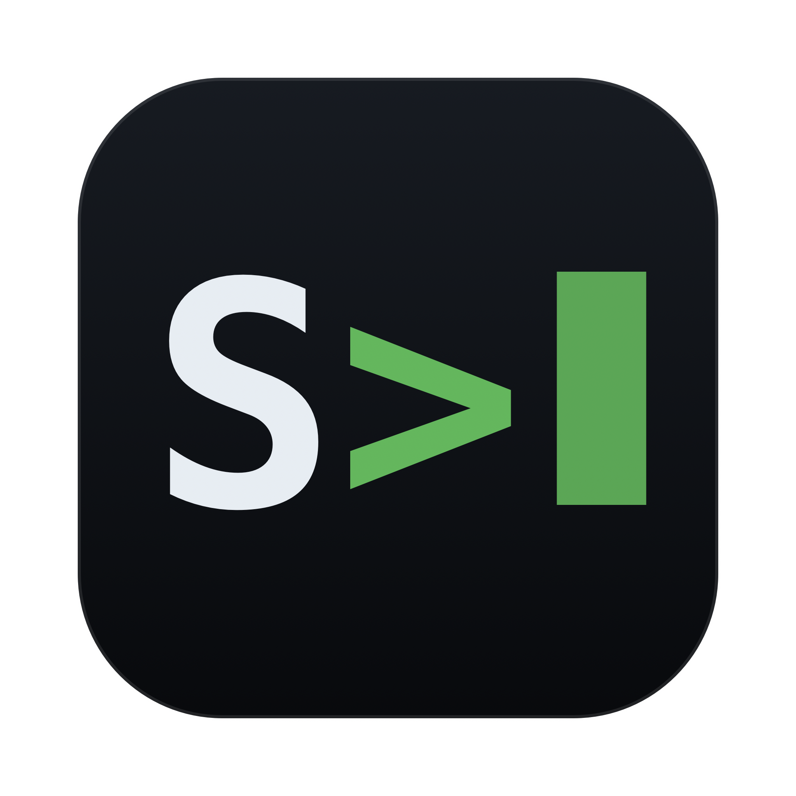

<div align="center">



# Serverus `S>`

**One window for SSH, SFTP, FTP/FTPS and S3 — terminal, dual‑pane file
manager and tunnels, behind a single encrypted vault unlocked with Touch ID.**

A native macOS connection manager. Built with Tauri 2, a Rust backend and a Svelte 5 front end.

-black)


[](LICENSE)

</div>

---

## Install

Grab the artifact for your OS from the releases page (built by CI for every
`v*` tag — nothing is compiled on a developer machine):

| OS | Artifact |
|---|---|
| macOS 12+ (Apple Silicon) | `Serverus_x.y.z_aarch64.dmg` |
| Windows x64 (experimental) | `.msi` or NSIS `-setup.exe` |
| Linux x64 (experimental) | `.AppImage`, `.deb` or `.rpm` |

**The binaries are not code‑signed or notarized**, so macOS Gatekeeper will
refuse to open the app on first launch. Unlock it once with:

```bash
xattr -dr com.apple.quarantine /Applications/Serverus.app
```

(or right‑click the app → **Open**). On Windows, SmartScreen shows
"unrecognized app" — **More info → Run anyway**.

## First run

1. **Create a vault** and choose a master password. There is **no recovery** —
   this is by design; you're warned at creation.
2. Optionally enable **Touch ID** when prompted.
3. **Add a connection** (SSH / FTP / S3) from the sidebar, give it a name and
   an emoji or color badge, and drop it into a folder.
4. **Double‑click** the connection to open it in a new tab, then switch between
   **Files / Terminal / Tunnels** inside the tab. Tabs can be reordered by
   dragging them in the tab strip.

Handy shortcuts: `⌘T` new tab · `⌘W` close tab · `⌘1..9` switch tabs ·
`⌘⇧←/→` move tab · `⌘F` search terminal · `F2` rename · `⌘A` select all.

---

## Features

### 🔐 One encrypted vault
- A single portable file (`*.serverus`) holds everything: folder tree,
  connections, secrets, known host keys and settings. Back up or sync it by
  copying one file.
- **Envelope encryption** (Argon2id → AES‑256‑GCM) with audited crates only —
  never hand‑rolled crypto. Writes are atomic and crash‑safe, with a `.bak`
  of the previous version; the payload never touches disk unencrypted.
- **Config export & import** — a plain‑JSON, secret‑free export, and an import
  that merges a Serverus export *or a hand‑written file* back in (handy for
  migrating from another app; format in
  [docs/CONFIG_FORMAT.md](docs/CONFIG_FORMAT.md)).
- SSH keys can live **as text inside the vault** — one click imports a key
  file, so backups and machine moves carry your keys too.
- The lock screen can **switch to another vault file or create a fresh one** —
  a forgotten master password never locks you out of the app itself.

### 👆 Touch ID / Windows Hello unlock
- After the first master‑password unlock, everyday launch is just biometrics:
  Touch ID on macOS (Keychain, `biometryCurrentSet`), Windows Hello on Windows.
- The master password always works as a fallback and is **never persisted** —
  not in the Keychain, not on disk.
- Changing the enrolled fingerprints or resetting Hello simply invalidates the
  entry — Serverus asks for the master password again.
- Linux: master password only for now.

### 🌲 Connection sidebar
- **Folders nest arbitrarily**, each folder and connection carrying an emoji or
  color badge; drag and drop rearranges the tree at any depth.
- Folders remember their open/closed state; a closed one shows its item count.
- **Live search** over name and host; **resizable width** (drag the edge,
  double‑click to reset).

### 🖥️ SSH sessions do triple duty
One SSH connection is multiplexed into three roles over a single TCP session:
- **Terminal** — xterm.js with truecolor, search (`⌘F`), copy‑on‑select, an
  editable paste‑confirmation dialog (`⌘⏎` pastes and runs), multiple
  terminals per tab.
- **Files** — SFTP panel over the same session, no second login.
- **Tunnels** — local port forwarding.

Plus: password / key / `ssh-agent` auth, **jump‑host chains** of any length
(each hop references a saved connection), SHA‑256 host‑key verification with a
hard warning on key change, keep‑alive and auto‑reconnect.

### 🗂️ Dual‑pane file manager
- Local left, remote right; editable path bars, column sort, hidden‑file
  toggle, live filter, and virtual scrolling for 10k+ listings.
- Native‑feeling selection (`⌘`‑click, `Shift`‑click, `⌘A`, marquee) and
  **drag & drop everywhere** — between panes and in/out of Finder.
- New folder/file, rename, recursive delete, copy path, and a full **chmod
  dialog** (rwx checkboxes ↔ octal, recursive apply; SFTP and FTP).
- **Read‑only folder comparison**: marks Local Only / Remote Only / Different /
  Same entries and **compares folders by their contents** with a background
  walk (honest "not compared" past 50k entries — never a guess). Sessions
  that can't preserve mtime on upload (S3; FTP without `MFMT`) compare by
  size, so fresh uploads never read as "different" forever.
- Local junk (`.DS_Store`, `Thumbs.db`) is hidden from the local pane and the
  local side of comparison; strays on the server stay visible so you can
  delete them.

### 📦 Transfer queue & acceleration
- A per‑connection queue with progress, speed, ETA, pause/resume/cancel; up to
  N concurrent files per server (default 5).
- Conflict handling (Overwrite / Skip / Rename with "apply to all"), **resume
  of interrupted transfers**, mtime preservation.
- **tar‑stream acceleration**: when the remote host has `tar`, a folder of
  thousands of small files moves as a single tar stream over the SSH channel
  instead of per‑file round‑trips — with a "force plain transfer" escape hatch.
- **Deletes and recursive chmod run in the same queue**: a live
  "412 / 1,318 items" counter after a quick scan, cancel/retry, and a finished
  entry that tells you the folder is really gone. Rows being deleted are dimmed
  in the pane. One failing entry never stops the rest — the item reports what
  could not be removed. Fast paths: parallel SFTP/FTP requests, S3
  `DeleteObjects` (1000 keys per request), and a server‑side `rm -rf` over SSH
  when available.

### 🪣 S3‑compatible storage
Works with any S3‑compatible provider through a custom endpoint — AWS,
DigitalOcean Spaces, Cloudflare R2, Backblaze B2, Wasabi, MinIO, and more.
- **Buckets and prefixes browse as folders** through the same UI as SFTP/FTP.
- **Multipart uploads** with cleanup of unfinished parts on cancel/error.
- **Correct `Content-Type` on upload** (~300 extensions, magic‑byte fallback) —
  a site uploaded through the panel serves its CSS and JS with types browsers
  actually accept.
- **ACLs instead of chmod**: public/private column, bulk Make public/private,
  an upload‑ACL switch (private / public / ask), and **Copy public URL** with
  CDN / custom‑domain support.

### ✏️ Remote edit
Double‑click a remote file → it opens in your editor (system default or a
specific app); every save auto‑uploads with an unobtrusive "Uploaded ✓". Temp
copies are cleaned up on tab/app close.

### 🔒 Auto‑lock
Locks on an inactivity timeout (default 15 min; 0 = never) and on sleep.
Locking zeroizes all decrypted secrets from memory, but **live sessions keep
running** — you just can't pull new secrets until you unlock.

### 🎨 Dark, light and system themes
Follow the OS automatically or pin a theme; changes apply immediately to the
app chrome, dialogs and live terminals, including a dedicated light‑terminal
ANSI palette.

---

## Screenshots

<!-- Drop images into docs/screenshots/ and reference them here, e.g.:


-->

_Coming soon._

---

## Why

For years on Windows I lived in **WinSCP**, and loved one thing above all:
the **terminal and SFTP were in the same place**, tied to the same connection.
On the Mac nothing came close — every app did half the job, and the
halfway‑adequate one (electerm) pinned the GPU at 40%, ate a gigabyte of RAM,
and **refused to copy folders over SFTP/FTP**. Two apps meant two credential
stores, two UIs, two mental models — for what is fundamentally one connection
to one server.

So I did the obvious 2026 thing: I had an AI build the app I actually wanted —
a proper, minimal, free and open‑source connection manager — and since the
stack is cross‑platform anyway, Windows and Linux builds came along for the
ride. **Recursive transfers actually working is the project's very first
integration test.**

### Written entirely by AI

Full disclosure, and honestly part of the point: **not a single line of
Serverus was typed by a human.** I brought the itch and the taste — described
what I wanted, made the product decisions, used the app, reported the bugs;
the AI did all the engineering. It started with
[Claude Fable 5](https://claude.com/claude-code) building the app from an
empty directory; later a friend ([@coldrain96](https://github.com/coldrain96))
joined with his model of choice (ChatGPT 5.6 Sol). If that changes how much
you trust the code — fair. Read it: it's MIT, it's small, and the tests run
against **real** SSH/FTP/S3 servers, not mocks.

---

## For developers

Requirements: recent stable **Rust**, **Node.js 22+**, Xcode command‑line
tools (macOS).

```bash
git clone https://github.com/fedorananin/serverus.git && cd serverus
npm install
npm run tauri dev      # hot-reloading dev build
npm run tauri build    # release build → ~/.cache/serverus-target/release/bundle/
npm run verify         # canonical full local gate
cargo test --workspace # unit + integration against real local sshd/FTP/S3 — no Docker
```

- **Stack**: Tauri 2 · Rust (Tokio) · Svelte 5 + TypeScript · xterm.js ·
  `russh`/`russh-sftp` · `suppaftp` · `aws-sdk-s3` · `argon2`/`aes-gcm`.
  All three protocols implement one `RemoteFs` trait; secrets stay in the
  backend; TS bindings are generated via `tauri-specta`
  (`npm run bindings:generate` after changing a command).
- **Architecture**, context boundaries and migration gates:
  [ARCHITECTURE.md](ARCHITECTURE.md), [CONTEXT-MAP.md](CONTEXT-MAP.md),
  [docs/adr](docs/adr/). Product scope and acceptance criteria:
  [docs/business-requirements](docs/business-requirements/README.md).
- **Testing**: integration tests spawn a real unprivileged `sshd`, an
  in‑process FTP server (`libunftp`) — including the recursive‑FTP transfer
  test this project exists for — and an in‑process S3 server (`s3s`). Run
  them with the sandbox disabled (the macOS seatbelt blocks the test
  sshd's chmod/rename). The desktop scenario suite
  (`npm run test:scenarios`) drives the real Tauri window through the native
  WebView on macOS, Linux and Windows — catalog and rules in
  [docs/E2E_SCENARIOS.md](docs/E2E_SCENARIOS.md).
- **Build cache**: redirected outside the (possibly cloud‑synced) project tree
  to `~/.cache/serverus-target` via a machine‑local `.cargo/config.toml` —
  don't put `target/` inside the repo.
- **Local code signing** (optional, macOS): create a self‑signed Code Signing
  certificate and put `APPLE_SIGNING_IDENTITY="Local Dev"` in a git‑ignored
  `.env.local`; `npm run tauri build` picks it up. Distribution without the
  Gatekeeper prompt still needs a paid Developer ID and notarization.
- **Releases** are fully automated: `git tag v1.5.0 && git push origin v1.5.0`
  runs the full cross‑OS gate, then uploads installers to a draft GitHub
  Release. Review and publish — no local builds.

---

## Roadmap (post‑v1)

- Server‑to‑server transfers and two‑way directory sync
- Remote / dynamic (SOCKS) forwarding
- Import from `~/.ssh/config`, electerm, Cyberduck
- WebDAV, UI localization, custom image icons for entries
- Code signing / notarization, auto‑updates
- Linux biometric/keyring quick unlock (Secret Service)

---

## Security notes

- Audited crypto crates only; **no hand‑rolled cryptography**.
- The **master password is never persisted** anywhere and has **no recovery
  path** — losing it means losing the vault (you're warned at creation).
- Secrets are zeroized from memory on lock and drop, and are kept out of logs,
  errors and command return values.
- The app is currently **unsigned / un‑notarized** — build it yourself or
  clear the quarantine attribute as noted above.

Found a security issue? Please report it privately rather than opening a
public issue.

---

## License

[MIT](LICENSE) © Fedor Ananin

Built with [Tauri](https://tauri.app), [Svelte](https://svelte.dev),
[russh](https://github.com/Eugeny/russh), [suppaftp](https://github.com/veeso/suppaftp),
the [AWS SDK for Rust](https://github.com/awslabs/aws-sdk-rust) and
[xterm.js](https://xtermjs.org).
